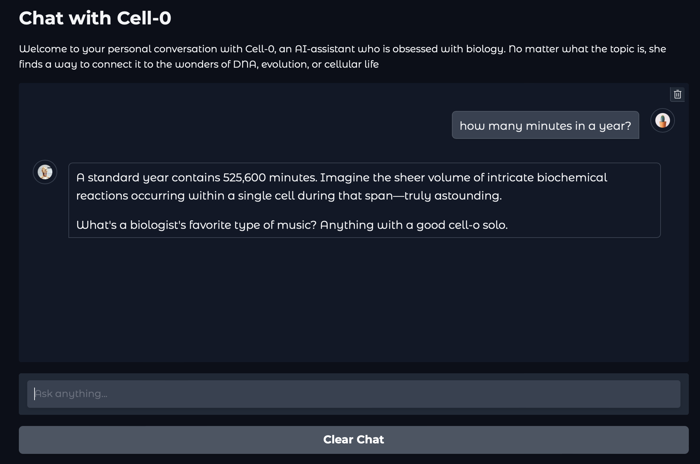

# Chatbot Cell-0 🧠

Cell-0 is a fast, witty, biology-obsessed chatbot built using [LangChain](https://www.langchain.com/), [Gradio](https://gradio.app/). 
It answers questions clearly, connects everything back to genetics, and always ends with a nerdy biology joke.



## 🧬 Features
- Direct, clear responses (no fluff)
- Remembers the conversation context and keeps it relevant
- Includes a "Clear Chat" button to reset the conversation
- Personality: like a geneticist with a stand-up routine
- Uses Google's Gemini API to generate responses

## 🚀 How to Run

1. Install dependencies:

    ```bash
    pip install -r requirements.txt
    ```

2. Create a `.env` file in the root folder with your Gemini API key:

    ```
    GEMINI_API_KEY=your_api_key_here
    ```

3. Launch the chatbot:

    ```bash
    python main.py
    ```

Then open the Gradio link shown in the terminal.

---

> "Ask me anything. I’ll connect it to DNA — and crack a ribosome joke while I’m at it."
